# StudyAgain

StudyAgain is a single page Q&A application where everyone can ask and answer questions on a specific topic.

This application is built with Laravel 5.4 (back-end) and AngularJS (front-end).

## Features

1. Users can register and login.
2. Users can view question and its answers.
3. Users can search questions by title, content, or tags.
4. Authorized users can ask, edit, or delete questions.
5. Authorized users can answers questions and edit or delete answers.
6. Authorized users can vote (vote up or vote down) questions and answers.

## How to Run

Initial setup:
1. Clone this repository (`git clone https://github.com/jordhy97/StudyAgain.git`).
2. Install [composer](https://getcomposer.org/) and [php](http://php.net/) (php >= 5.6.4)
3. `composer install`  
4. `cp .env.example .env`  
5. `php artisan key:generate`  
6. `php artisan migrate` (have to create the database first, database config is in .env)
7. `php artisan db:seed` (optional)

Run the application with `php artisan serve` and open the link provided.

## To Do List

- Back-end:
    - [x] Create database schema (migration files). 
    - [x] Create database models.
    - [x] Create models' controller.
    - [x] Set API routes.
    - [x] Create database seeder.
    - [x] Create unit tests.
    
 - Front-end:
    - [x] Create main page. 
    - [x] Create search results page.
    - [x] Create tagged question page.
    - [x] Create tag page.
    - [x] Create question page.
    - [x] Create login form.
    - [x] Create register form.
    - [x] Create ask a question form.
    - [x] Create answer question form.
    - [x] Create edit question form.
    - [x] Create edit answer form.
    
## Screenshots

 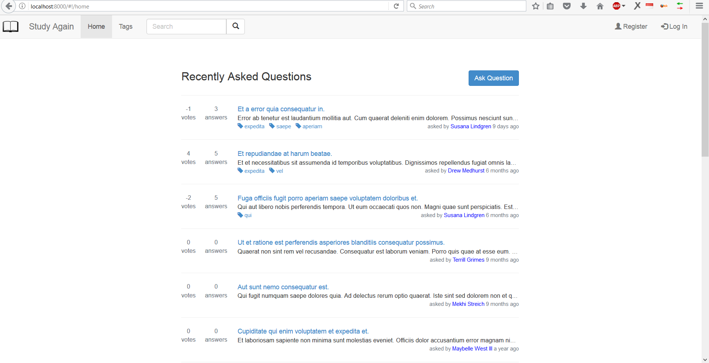
 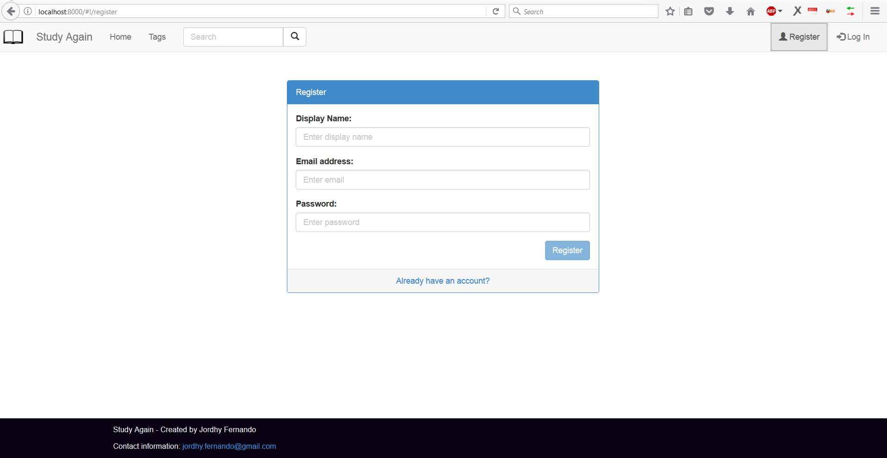
 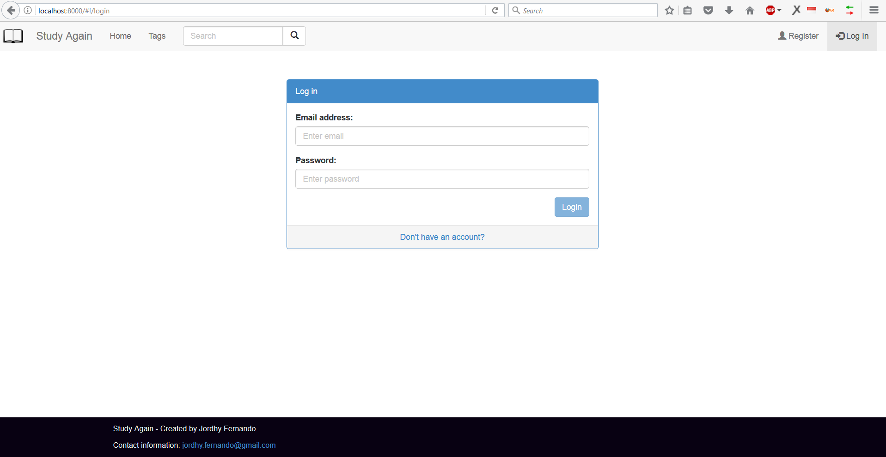
 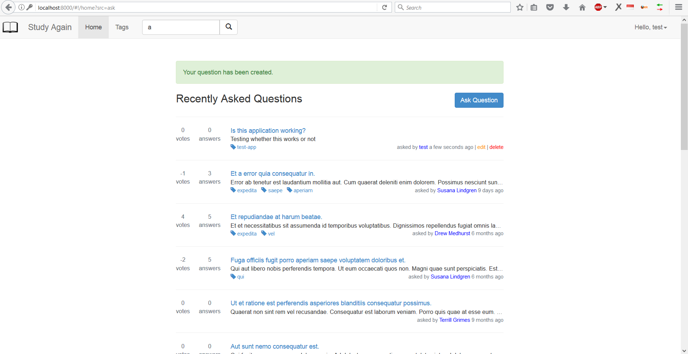
 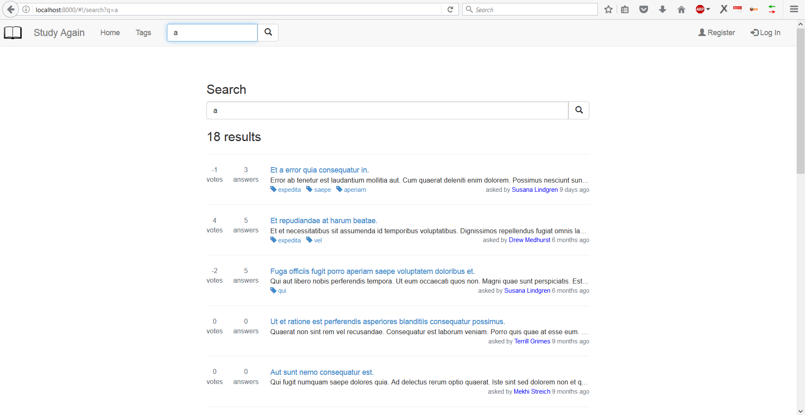
 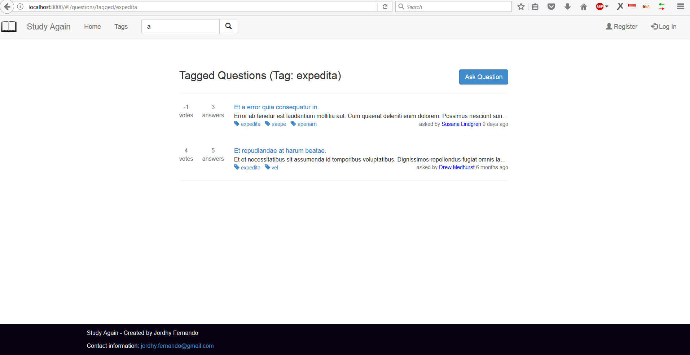
 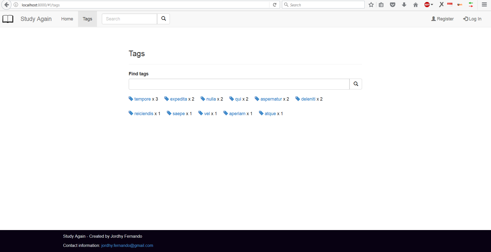
 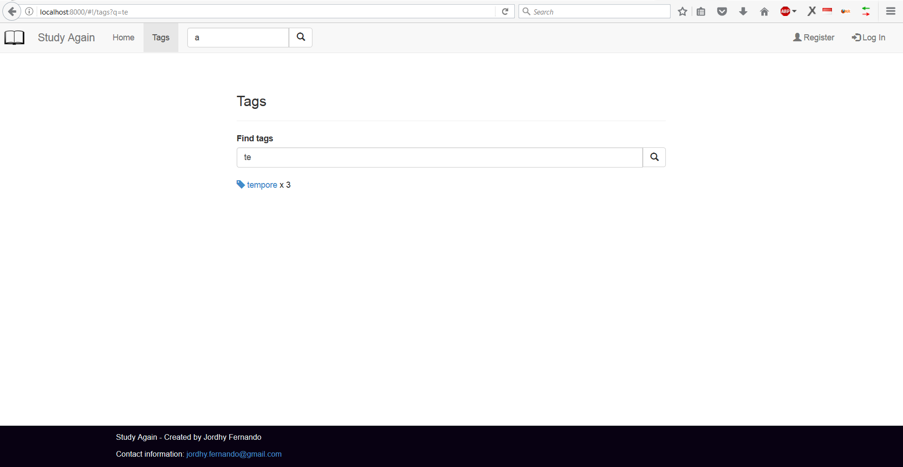
 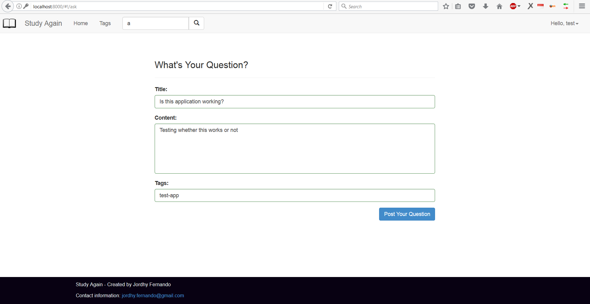
 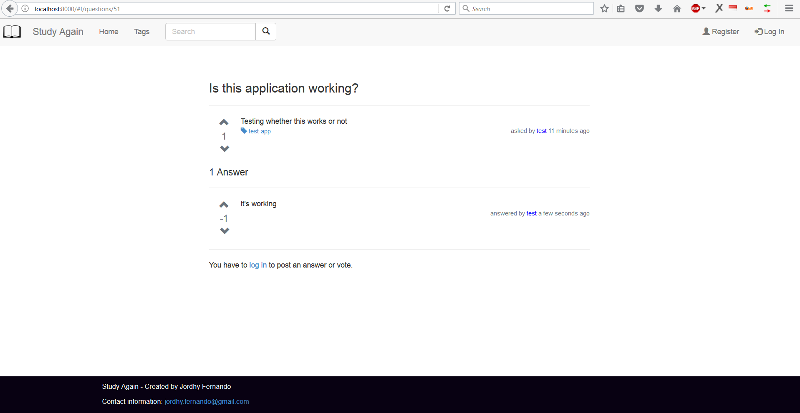 
 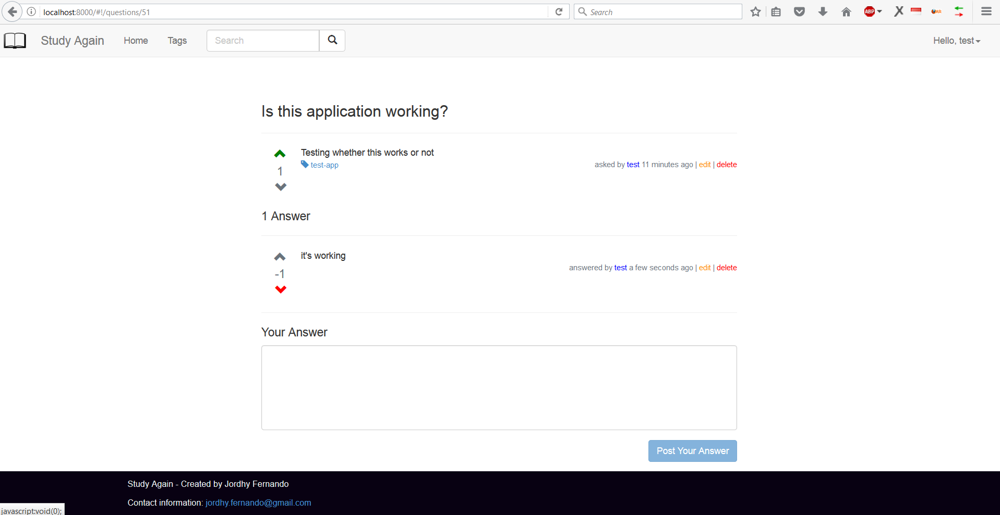 
 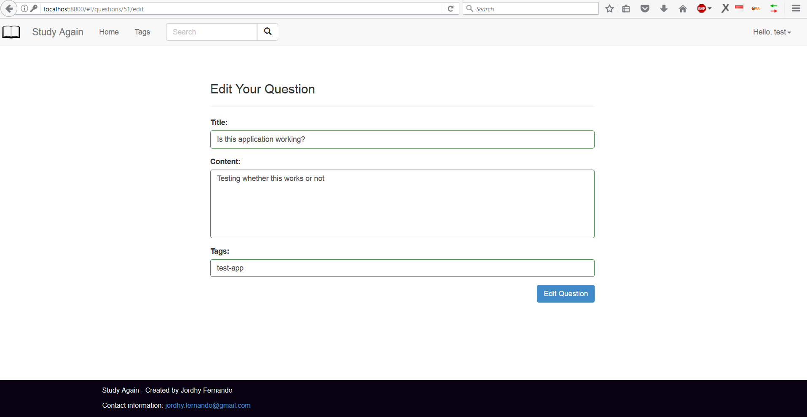 
 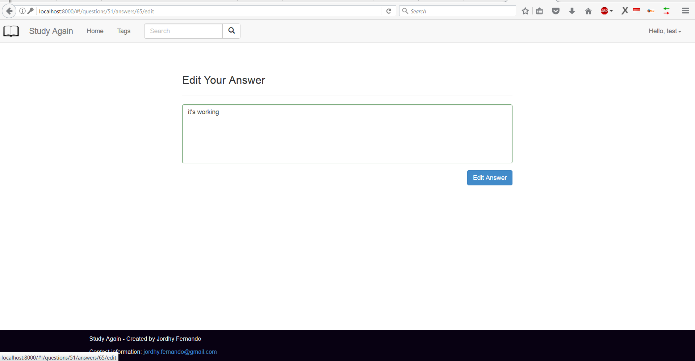 

